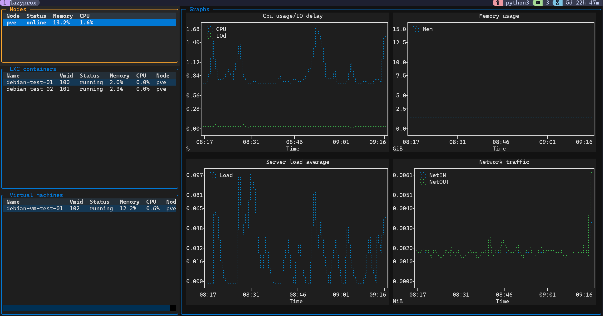
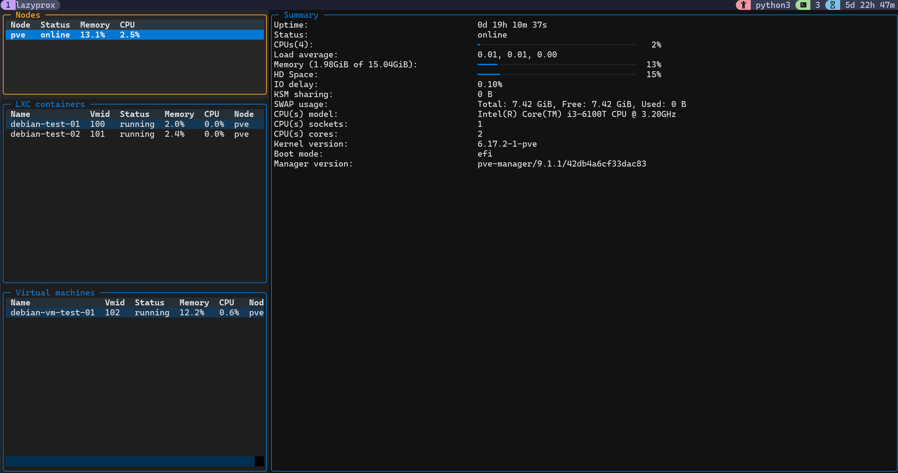
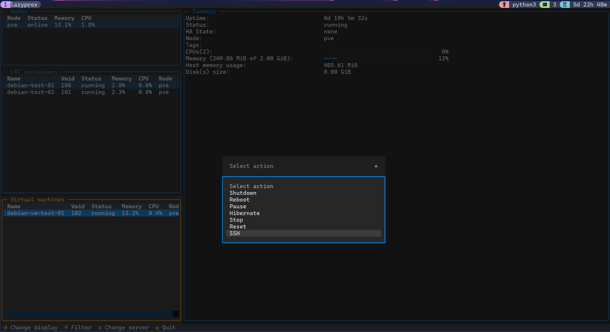

  

# LazyProx

LazyProx is a lightweight Proxmox management helper that makes it easy to view and act on nodes, containers, and virtual machines. It provides a clean UI for exploring your Proxmox infrastructure and quickly selecting actions.

See the included asciinema animation for a short demo of how the tool works.

## Installation

You have to have Python 3.10 or higher installed on your system to run the tool. LazyProx is developed and tested on Linux, it is tested also on Windows WSL2, but it should work on any platform that supports Python.

> [!NOTE]
> LazyProx is using HTTP API of Proxmox, so you need to have access to it from the machine you want to run the tool on. 

### Using UV

to install run `uv tool install git+https://github.com/benzino77/lazyprox.git`

to upgrade run `uv tool upgrade lazyprox`

to uninstall run `uv tool uninstall lazyprox`

> [!NOTE]
> UV can be installed following instructions on [uv Installation page](https://docs.astral.sh/uv/getting-started/installation/)

### Using pipx

to install run `pipx install git+https://github.com/benzino77/lazyprox.git`

to upgrade run `pipx upgrade lazyprox`

to uninstall run `pipx uninstall lazyprox`

## Running

To run the tool, simply run `lazyprox` in your terminal. To get best experience you should use `Nerd Font` family fonts in your terminal.

Although it is rather easy to get information about the structure of the configuration file from the code, and what needs to be configured on the proxmox server side, you can also get it in a more user-friendly format by buying me a coffee. If you want to support the project and get the instructions on how to create the configuration file with all the necessary details and examples in PDF format, you can do so via [Ko-fi](https://ko-fi.com/benzino77).

## Disclaimer

Everything you do, you do on your own responsibility. I do not take any responsibility for damages or problems, that may arise as a result of using this solution or its products. It is provided "as is" without any warranties or guarantees. Use it at your own risk.

## License

LazyProx is licensed under the [MIT license](LICENSE).
